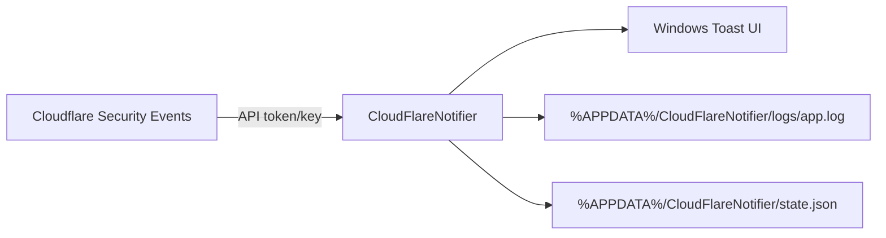

# CloudFlareNotifier
[](https://www.cloudflare.com)
[](https://learn.microsoft.com/windows/apps/design/shell/tiles-and-notifications/toast-notifications)
[](https://www.python.org/)

Windows toast notifier for Cloudflare security events. It polls Cloudflare's APIs for your zones and surfaces new security events as native Windows notifications--no dashboard tab required.

## Why this exists
- Keep personal or small-team sites observable without a full SIEM stack.
- Native Windows toasts are visible across desktops, laptops, and focus modes.
- One tiny config file, optional one-file EXE build, and persistent state to prevent duplicate pings.

## Highlights
- Detailed toasts: action/outcome, source, client IP, country, rule message, Ray ID.
- Multiple zones in one process.
- Stateful deduplication via `%APPDATA%/CloudFlareNotifier/state.json`.
- Config template is created and auto-opened on first run.
- Works with Cloudflare API token (preferred) or legacy Global API key.

## Visuals
- **Notification example**: title `example.com: block`; body `Firewall - 203.0.113.5 (DE) | SQLi detected | Ray ID: 6e4d7f0abc123456`.
- **Data flow**:


## Quick install
Full guide: [INSTALL.md](INSTALL.md). Short version:
```powershell
python -m pip install -r requirements.txt
python src/main.py
```
- First start writes `%APPDATA%/CloudFlareNotifier/config.cfg`, opens it, and exits with a message.
- Fill `api_token` **or** (`api_key` + `email`), set `zone_ids`, tweak `poll_interval`, `lookback_minutes`, `verify_ssl` as needed.

## Running
```powershell
python src/main.py
```
Logs live at `%APPDATA%/CloudFlareNotifier/logs/app.log`.

## What a toast contains
- Title: `<zone name>: <action>`
- Body: `<source> - <client IP> (<country>) | <rule message> | Ray ID: <id>`
- Missing fields in the event are omitted.

## Building a one-file EXE
- Windows build via PyInstaller: `BUILD.bat`
- Output: `dist/CloudFlareNotifier.exe` (one-file, no console).

## Operational notes
- `lookback_minutes` defines the initial fetch window to avoid alert floods after downtime.
- State is at `%APPDATA%/CloudFlareNotifier/state.json`; delete it to force a full refresh.
- No system tray icon: stop with `Ctrl+C` in the console or end the `CloudFlareNotifier` process in Task Manager. Restart with the same command/EXE. Config is always at `%APPDATA%/CloudFlareNotifier/config.cfg`.
